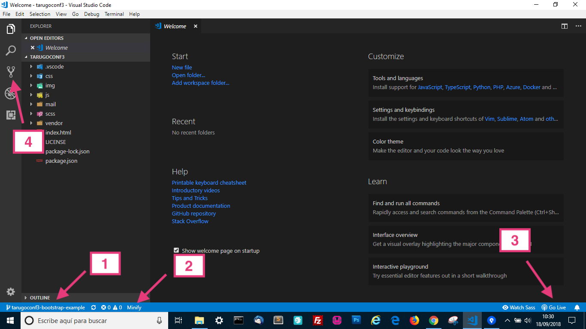
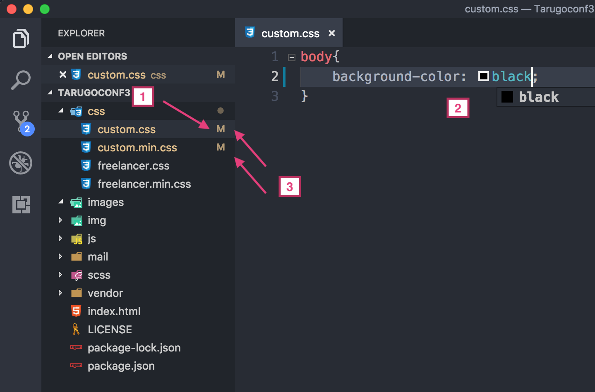
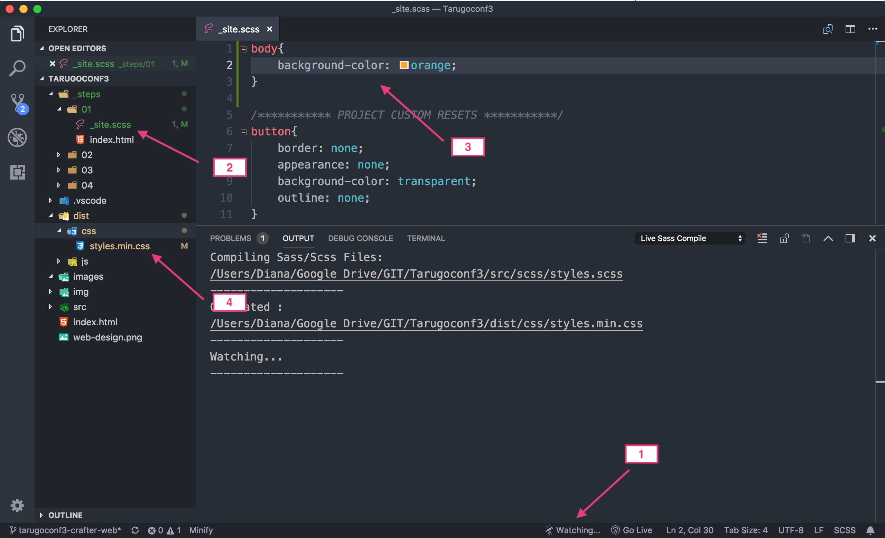

## **Probando el entorno de la rama TARUGOCONF3-BOOTSTRAP-EXAMPLE**
Entráis en dicha rama desde VSCode y hacéis lo siguiente para asegurarnos que funciona todo bien.

1. 	**Ver si se activa el visor de git (1), el minify (2), y el live server (3)**, salen en la barra de estado.

	Pulsad en "Go Live" (3) y debería abrirse el proyecto en el navegador.

	(Nota: el servidor está configurado en el puerto 3001, si lo tenéis ocupado con otra cosa tenéis que cambiarlo en los user settings, si no sabéis, me lo decís).

	No me sale, ¿qué hago?:

	- Hay que darle un momento, en Windows a mí me tarda un poco, en Mac es casi inmediato al abrir el proyecto. (NO QUIERO DECIR NADA CON ESTO)
	- Si no reconoce el repositorio, pinchad en el explorador de git (4) a ver si así espabila.
	- Si no se activa el live server, poneos encima del index.html -> botón derecho -> "Open with live server".

	

	Si nada de esto funciona, haced algún plan para el jueves por la mañana y no vengáis al taller. :-P

	Es broma, enviadme un mail para solucionar todo antes del taller y no perder allí tiempo.

2. 	**Probar minify**

	Os metéis en el directorio **"css"**, abrís **"custom.css"** (1), cambiáis el color del background (2) y **verificáis que os minifica el archivo (custom.min.css) (3) en la misma carpeta**.

	Ambos archivos deberían aparecer como **"modificados"** (3).

	

## **Probando el entorno de la rama TARUGOCONF3-CRAFTER-WEB**
Entráis en dicha rama desde VSCode y hacéis lo siguiente para asegurarnos que funciona todo bien.

1. 	**Ver si se activa todo lo anterior (git, minify, live server) Y ADEMÁS EL COMPILADOR DE SASS**

	Tiene que salir en la barra de estado **"Watch Sass"**.
	

2. 	**Poner en marcha el compilador Sass**

	Arranco el compilador pulsando donde pone **“Watch Sass”** cambiará a **“Watching…”** y en consola nos dice que está escuchando.(1)

3. 	**Probar el compilador Sass**

	Me voy a **steps/01/_site.scss** (2), lo abro, pongo arriba del todo cualquier cosa en css (3), guardo, y **me aseguro que me está modificando styles.min.css dentro de dist/css/** (4)

4. 	**BORRO el código que he puesto de prueba** para que no nos quede ahí para el taller.

	

